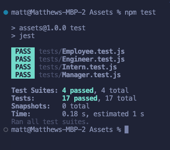

# Team-Profile-Generator-MD

## Description
As a user, I want to generate a webpage that displays my team's basic info so that a user have quick access to their emails and GitHub profiles.

## Table of Contents

- [Installation](#installation)
- [About](#about)
- [License](#license)
- [Acknowledgement](#acknowledgement)
- [Deployed Link](#deployed-link)
- [Author](#author)

## Installation 

N/A

## About
My goal with this application was to be able to collect data from the terminal inputted by the user and print these to a html file displaying and showcasing the inputted data. This then would be tested using jest. 

I started off by adding in the DS_Store to the gitignore within the starter code as i am using a Mac. I then followed the steps to create the appropirate questions for each role. One they were all added in I ran node index.js in the built in terminal. 

You can see here the command line prompts when running node

The user is first greeted with the input option for the manager. It asks for their name, employee ID, email and office number (which was requested within the task). 

Once you have added the managers details you can then choose to add an engineer, and intern or finish building the team. The input questions within the terminal are what has been requested in the task. 

Once all team member have been added in you will see the message displayed 'Team profile successfully generated in team.html. As seen below. 

This then prints to rhe team.html in the output folder and displays like this on a browser. 

The other part of the challenge was to be able to utilise jest and run tests on our code. This was accomplished by calling 'npm test' in the intergrated terminal. Below is a screen shot of the results. It passed all the tests set out. 

## License

MIT License

Copyright (c) [2024] [Dudman-Matt]

Permission is hereby granted, free of charge, to any person obtaining a copy of this software and associated documentation files (the "Software"), to deal in the Software without restriction, including without limitation the rights to use, copy, modify, merge, publish, distribute, sublicense, and/or sell copies of the Software, and to permit persons to whom the Software is furnished to do so, subject to the following conditions:

The above copyright notice and this permission notice shall be included in all copies or substantial portions of the Software.

THE SOFTWARE IS PROVIDED "AS IS", WITHOUT WARRANTY OF ANY KIND, EXPRESS OR IMPLIED, INCLUDING BUT NOT LIMITED TO THE WARRANTIES OF MERCHANTABILITY, FITNESS FOR A PARTICULAR PURPOSE AND NONINFRINGEMENT. IN NO EVENT SHALL THE AUTHORS OR COPYRIGHT HOLDERS BE LIABLE FOR ANY CLAIM, DAMAGES OR OTHER LIABILITY, WHETHER IN AN ACTION OF CONTRACT, TORT OR OTHERWISE, ARISING FROM, OUT OF OR IN CONNECTION WITH THE SOFTWARE OR THE USE OR OTHER DEALINGS IN THE SOFTWARE.

## Acknowledgement 

Help, support and guidence was offered by - 

Thomas Jack || [Github](https://github.com/quikstart86)

Georgie Lillington || [Github](https://github.com/georgielill)

## Deployed Link/HTML
 * [See Here](file:///Users/matt/Bootcamp/Team-Profile-Generator-MD/challenge/Assets/output/team.html)

## Author
 * [Matt Dudman](https://github.com/atypicalbitter)

* The URL of the GitHub repository, with a unique name and a readme describing the project.
